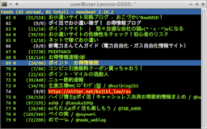
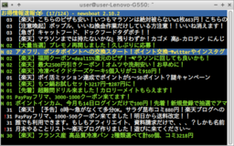
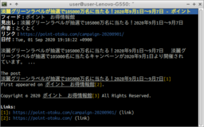

# Vim Style Newsboat

  

Vim Style Newsboatは[Vim](https://www.vim.org/), [Pentadactyl](https://github.com/pentadactyl/pentadactyl)のキーボード操作を[Newsboat](https://newsboat.org/)及び[Newsbeuter](https://www.newsbeuter.org/)と[Newsbeuter](https://github.com/akrennmair/newsbeuter)でも実現する試みのプロジェクトです。

VimはCLIのスクリーンエディタ、PentadactylはWebブラウザー[Pale Moon](https://www.palemoon.org/)のアドオン、NewsboatとNewsbeuterはCLIのFeed(RSS/Atom)リーダーです。ソフトウェアの性質の違い故に全てのキーボード操作を模倣出来ている訳ではありませんが、基本的な操作の模倣は完了しております。

テストはnewsboat r2.22とnewsbeuter 2.9で行っています。それ以外のバーションでの動作は未確認です。

# 機能

 * `h`, `j`, `k`, `l`, `^F`, `^B`, `G`, `:`, `!`, `/`などのVim風のキーボード操作
 * `r`, `a`, `f`, `;`, `m`, `b`, `^N`, `^P`, `d`などのPentadactyl風のキーボード操作
 * ダークとモノクロームの2種類のカラースキーム
 * Webブラウザーの切り替えやヤンクなどのマクロを定義
 * 便利なフィルターとクエリの定義

# 使い方

まずこのプロジェクト内のディレクトリとファイルをそのままホームディレクトリにコピーしてください。その後`~/.newsboat/config`に次の内容を追加してください。

~~~
include "~/.newsboat/color"
include "~/.newsboat/filter"
include "~/.newsboat/keymap"
include "~/.newsboat/macro"
~~~

ご使用の端末の言語環境に合わせて`~/.newsboat/color`内の一部をコメントアウトします。例えば日本語環境であれば次のように変更してください。

~~~
# Japanese
highlight article "^フィード：|^見出し：|^作者：|^日付：|^リンク：|^Flags: |^コンテンツ：" white black bold
highlight article "^Links: $" white black bold
~~~

Newsboatを起動してスクリーンショットのような彩色が反映され、`j`, `k`などで移動操作が出来れば初期設定は完了です。

## マクロ

Vim Style Newsboatでは幾つのマクロが定義されており、`~/.newsboat/macro`を読み込むと使用可能です。デフォルトのマクロプレフィックスは`@`であり、それに続けて次のキーを押すと次の動作を行います。

| キー | 詳細説明                                                                                        |
| ---- | ----------------------------------------------------------------------------------------------- |
| `^`  | 最初のダイアログに移動します。                                                                  |
| `$`  | 最後のダイアログに移動します。                                                                  |
| `0`  | フィードリンクのURIまたは記事のURIを任意のプログラムで開きます。                               |
| `1`  | フィードリンクのURIまたは記事のURIを[FireFox](https://www.mozilla.org/firefox/)で開きます。     |
| `2`  | フィードリンクのURIまたは記事のURIを[Chromium](https://www.chromium.org/Home)で開きます。       |
| `3`  | フィードリンクのURIまたは記事のURIをEメールで送信します。                                       |
| `4`  | フィードリンクのURIまたは記事のURIをQRコードに変換して表示します。                             |
| `5`  | フィードリンクのURIまたは記事のURIを[Lynx](http://lynx.browser.org/)で開きます。                |
| `6`  | フィードリンクのURIまたは記事のURIを[w3m](http://w3m.sourceforge.net/)で開きます。              |
| `7`  | フィードリンクのURIまたは記事のURIを[GNU Wget](https://www.gnu.org/software/wget/)で開きます。  |
| `8`  | フィードリンクのURIまたは記事のURIを[curl](https://curl.haxx.se/)で開きます。                   |
| `9`  | フィードリンクのURIまたは記事のURIを[youtube-dl](https://youtube-dl.org/)で開きます。           |
| `i`  | 現在の記事をテキストエディタで開きます。                               　　　　　               |
| `m`  | フラグが付けられた記事の一覧を開きます。                                         　　　　　     |
| `o`  | フィードリンクのURIまたは記事のURIをテキストエディタで開き、そのURLをWebブラウザーで開きます。 |
| `O`  | 未読記事のURLをテキストエディタで開き、そのURLをWebブラウザーで開きます。                       |
| `y`  | フィードリンクのURIまたは記事のURLをヤンクします。                                              |
| `Y`  | 現在の記事の内容をヤンクします。                                                                |

`xsel`や`xclip`がインストールされている環境では、ヤンクにクリップボードを使用することも可能です。`~/.newsboat/macro`内のヤンクに関する当該行をコメントアウトしてください。例えば`xsel`を使用する場合は次の行を有効にしてください。

~~~
macro y set browser "echo %u | xsel --input --primary; echo %u | xsel --input --clipboard" ; open-in-browser ; set browser "${BROWSER:-lynx --} %u"
macro Y pipe-to "tmpFile=$(mktemp); cat >${tmpFile}; cat -- ${tmpFile} | xsel --input --primary; cat -- ${tmpFile} | xsel --input --clipboard; rm -f -- ${tmpFile}"
~~~

## 環境変数

Vim Style Newsboatでは次の環境変数を参照します。環境変数の値を変更することにより、動作の変更が可能です。

| 環境変数名                  | 詳細説明                                                                                                                                    |
| --------------------------- | ------------------------------------------------------------------------------------------------------------------------------------------- |
| `BROWSER`                   | 使用するWebブラウザーを指定します。この変数が存在しない場合か、値が空文字列の場合には`lynx`を使用します。                                  |
| `EDITOR`                    | 使用するテキストエディタを指定します。この変数が存在しない場合か、値が空文字列の場合には`vi`を使用します。                                  |
| `MAILER`                    | 使用するメーラーを指定します。メーラーは[mailto URI Scheme](https://www.ietf.org/rfc/rfc6068.txt)が処理可能である必要があります。          |
| `VIMSTYLENEWSBOAT_YANKFILE` | ヤンクした内容を追加するファイルのパスを指定します。この変数が存在しない場合か、値が空文字列の場合には`${HOME}/newsboat-yank`を使用します。 |
| `VISUAL`                    | 使用するテキストエディタを指定します。この変数が存在しない場合か、値が空文字列の場合には`${EDITOR}`を使用します。                          |

# ToDoリスト

 * ブックマークへ追加するプログラムの作成

# ライセンス

Vim Style NewsboatはCC BY 4.0で配布されています。このライセンスに従う限りに於いて自由に改変や再配布を行えます。ライセンスの詳細は[LICENSE](LICENSE)を参照してください。

# 謝辞

Vim Style Newsboatを作成するにあたり、次のソフトウェアの機能を参考にしました。当該ソフトウェアの開発者の皆様に感謝の意を表します。

 * [Newsboat](https://newsboat.org/)
 * [Newsbeuter](https://github.com/akrennmair/newsbeuter)
 * [Vim](https://www.vim.org/)
 * [Pentadactyl](https://github.com/pentadactyl/pentadactyl)
