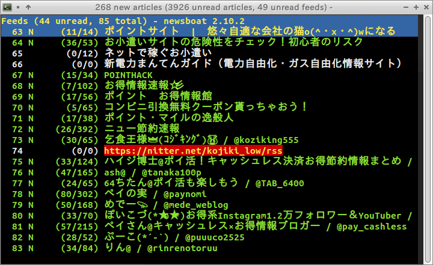
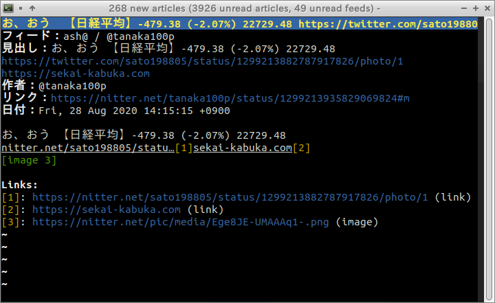

# Vim Style Newsboat

  

このプロジェクトは[Vim](https://www.vim.org/), [Pentadactyl](https://github.com/pentadactyl/pentadactyl)のキーボード操作を[Newsboat](https://newsboat.org/)でも実現する試みです。

VimはCLIのスクリーンエディタ、PentadactylはWebブラウザー[Pale Moon](https://www.palemoon.org/)のアドオン、NewsboatはCLIのFeed(RSS/Atom)リーダーです。ソフトウェアの性質の違い故に全てのキーボード操作を模倣出来ている訳ではありませんが、基本的な操作の模倣は完了しております。

テストはnewsboat 2.10.2で行っています。それ以外のバーション及び[Newsbeuter](https://www.newsbeuter.org/)での動作は未確認です。

# 使い方

このプロジェクト内のディレクトリとファイルをそのままホームディレクトリにコピーしてください。その後`~/.newsboat/config`に以下の内容を追加してください。

~~~
include "~/.newsboat/color"
include "~/.newsboat/filter"
include "~/.newsboat/keymap"
include "~/.newsboat/macro"
~~~

ご利用の端末の言語環境に合わせて`~/.newsboat/color`内の一部をコメントアウトします。例えば日本語環境であれば以下のように変更してください。

~~~
# Japanese
highlight article "^フィード：|^見出し：|^作者：|^日付：|^リンク：|^Flags: |^コンテンツ：" white black bold
highlight article "^Links: $" white black bold
~~~

Newsboatを起動しスクリーンショットのような	彩色が反映され、`j`, `k`などで操作出来れば、初期設定は完了です。

## マクロ

Vim Style Newsboatでは幾つのマクロが定義されており、`~/.newsboat/macro`を読み込むと利用可能です。デフォルトのマクロプレフィックスは`@`であり、それに続けて当該キーを押すと以下の動作を行います。

| キー | 説明                                                                                  |
| ---- |-------------------------------------------------------------------------------------- |
| `^`  | 最初のダイアログに移動します。                                                        |
| `$`  | 最後のダイアログに移動します。                                                        |
| `1`  | 現在のフィードか記事のURLを[FireFox](https://www.mozilla.org/firefox/)で開きます。    |
| `2`  | 現在のフィードか記事のURLを[Chromium](https://www.chromium.org/Home)で開きます。      |
| `3`  | 現在のフィードか記事のURLをEメールで送信します。                                      |
| `5`  | 現在のフィードか記事のURLを[Lynx](http://lynx.browser.org/)で開きます。               |
| `6`  | 現在のフィードか記事のURLを[w3m](http://w3m.sourceforge.net/)で開きます。             |
| `7`  | 現在のフィードか記事のURLを[GNU Wget](https://www.gnu.org/software/wget/)で開きます。 |
| `8`  | 現在のフィードか記事のURLを[curl](https://curl.haxx.se/)で開きます。                  |
| `9`  | 現在のフィードか記事のURLを[youtube-dl](https://youtube-dl.org/)で開きます。          | 
| `i`  | 現在の記事をテキストエディタで開きます。                                              |
| `m`  | フラグが付けられた記事の一覧を開きます。                                              |
| `o`  | 現在のフィードか記事のURLをテキストエディタで開き、そのURLをWebブラウザーで開きます。 |
| `O`  | 未読記事のURLをテキストエディタで開き、そのURLをWebブラウザーで開きます。             | 
| `y`  | 現在のフィードか記事のURLをヤンクします。                                             |
| `Y`  | 現在の記事内容をヤンクする                                                            |

`xsel`や`xclip`がインストールされている場合、ヤンクにクリップボードを使用することも可能です。`~/.newsboat/macro`内のヤンクに関する当該行をコメントアウトしてください。例えば`xsel`の場合以下の行を有効にしてください。

~~~
macro y set browser "echo %u | xclip -selection 'primary'; echo %u | xclip -selection 'clipboard'" ; open-in-browser ; set browser "${BROWSER-lynx --} %u"
macro Y pipe-to "tmpFile=$(mktemp); cat >${tmpFile}; cat -- ${tmpFile} | xsel --input --primary; cat -- ${tmpFile} | xsel --input --clipboard; rm -f -- ${tmpFile}"
~~~

# 謝辞

当プロジェクトを作成するにあたり、以下のソフトウェアの機能を利用、若しくは参考にしました。当該ソフトウェアの開発者の皆様に感謝の意を表します。

 * [Newsboat](https://newsboat.org/)
 * [Vim](https://www.vim.org/)
 * [Pentadactyl](https://github.com/pentadactyl/pentadactyl)
